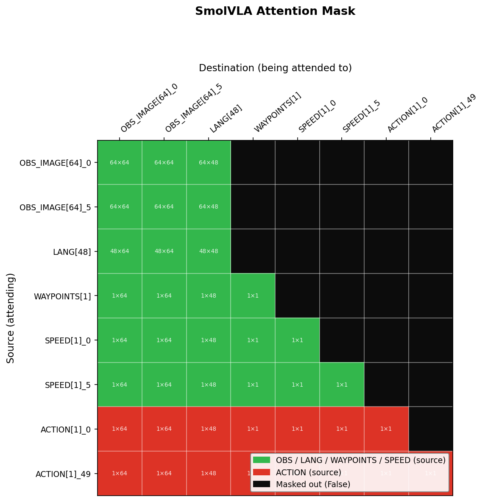

Images && language cannot attend to states.

(Waypoints also cannot attend to states but that makes sense).

---

No explanation in the paper.

No "straigth forward" explanation, only hypothesis, but none of which are particularly convincing.
Honestly, I see no reason for not enabling the bidirectional attention on the prefix level (images, lang, states).

1. States and actions share the same "input" space in the original SmolVLA
states == previous_actions
Images cannot see future actions - that would be cheating.
Since future actions are based on state (previous actions), allowing them to see the previous actions would be "half cheating".
2. Frozen VLM
VLM is frozen during fine-tuning of action expert.
The state token was not present in VLM training.

Premise: allowing (images, lang) to attend to state would be out-of-distribution the internal VLM representation, which only saw image and text.